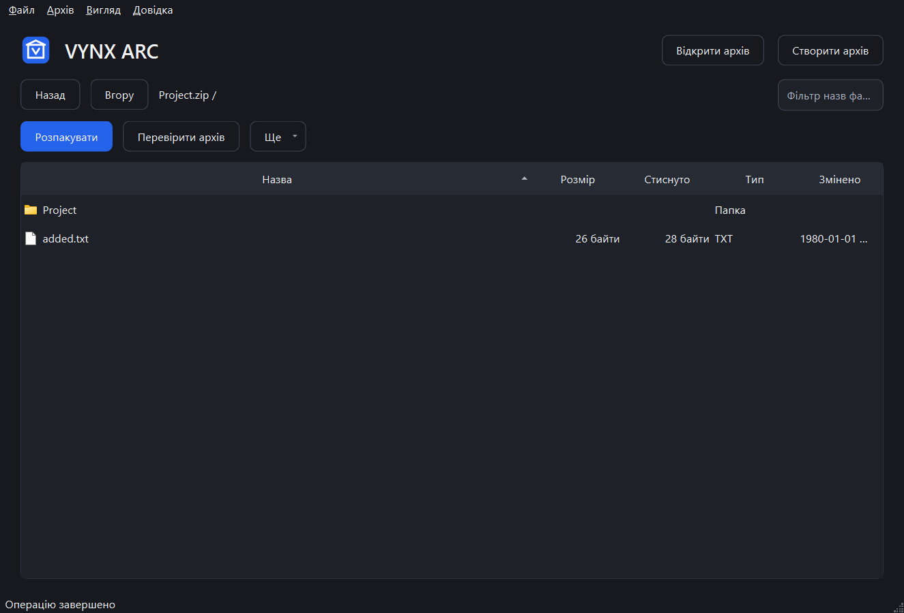

# VYNX ARC

An offline Windows archive manager built with C++20 / Qt 6 Widgets and a Rust
archive core connected through CXX. This repository contains a working **0.1.0
development milestone**. The supplied master brief remains the V1 contract;
this milestone does not satisfy the full contract.

Open, browse, search, select, test and extract ZIP, 7Z, RAR4/RAR5, TAR and TAR.GZ.
Create ZIP, 7Z, TAR and TAR.GZ, including AES-encrypted ZIP and encrypted 7Z
filenames. Operations run asynchronously with progress and cancellation.
The browser uses Qt model/view, with folder navigation, sortable columns,
keyboard shortcuts and drag-to-open. English, Ukrainian and Russian UI,
system/light/dark appearance, local recent history and portable settings are
available. No external archiver, browser engine, telemetry or service is used.

Extraction validates Windows paths and collisions, blocks links/reparse points,
checks output limits, writes unique temporary files and publishes completed
streams. Existing files are preserved by default. These protections are tested,
but complete parser allocation budgets and filesystem race hardening still need
review before a production release.



## Run

Locally generated artifacts are under `dist/` (ignored by Git):

- `VYNX-ARC-Portable-x64.zip`: extract the complete directory and run `VynxArc.exe`.
- `VYNX-ARC-Setup-x64.exe`: per-user installer; optional shortcuts and Open With.
- `SHA256SUMS.txt`: SHA-256 checksums of those artifacts.

The binaries are unsigned. The portable package passed tests with only Windows
directories on PATH. Installer compilation passed; clean-VM installation and
uninstallation have not been tested. Windows 11 x64 is the tested platform.
No development SDK is required to run the packages.

## Build

Install the pinned Rust MSVC toolchain, Qt 6.12.0 MSVC SDK, Visual Studio 2022
C++ Build Tools and Windows SDK, CMake and Ninja. See [BUILD.md](docs/BUILD.md).

```powershell
$env:VYNX_QT_ROOT = "$env:LOCALAPPDATA\VynxArcDev\QtMSVC"
scripts/build.ps1
scripts/build-release.ps1
```

Release packaging additionally requires Python for license collection and Inno
Setup 6 for the installer. `-SkipInstaller` generates only the portable package.

The bundled CLI supports `list`, `extract`, `create`, `test` and `hash`.
Run `vynxarc-cli --help`. Password operations currently use the GUI; secrets on
the command line are intentionally unsupported.

## Project status

[IMPLEMENTATION_STATUS.md](docs/IMPLEMENTATION_STATUS.md) records evidence,
limitations and remaining work. [SUPPORTED_FORMATS.md](docs/SUPPORTED_FORMATS.md)
defines actual format capabilities. [SECURITY_MODEL.md](docs/SECURITY_MODEL.md)
documents protections and incomplete security gates.

The application is MIT licensed. Qt and UnRAR retain their separate licenses;
see [THIRD_PARTY_NOTICES.md](THIRD_PARTY_NOTICES.md) and the packaged `licenses/`
directory. RAR encoding is not implemented.
