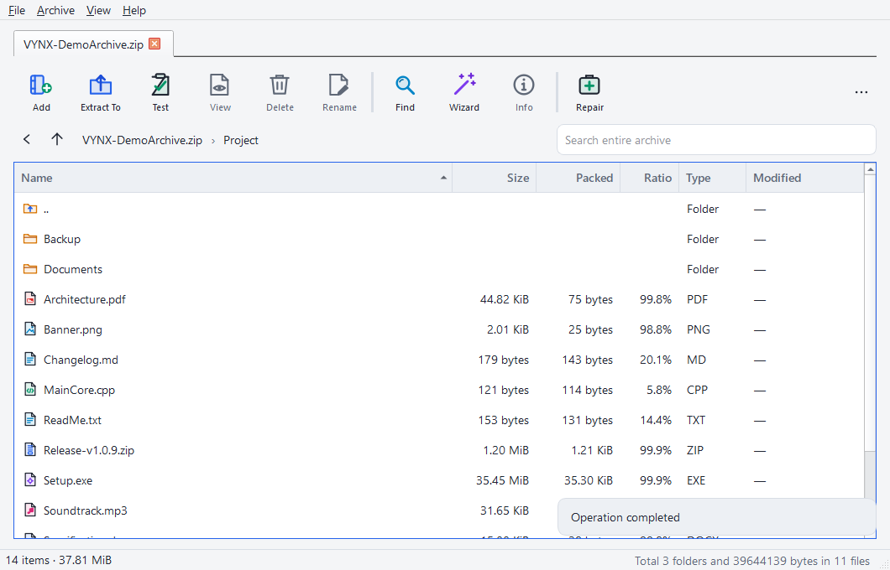
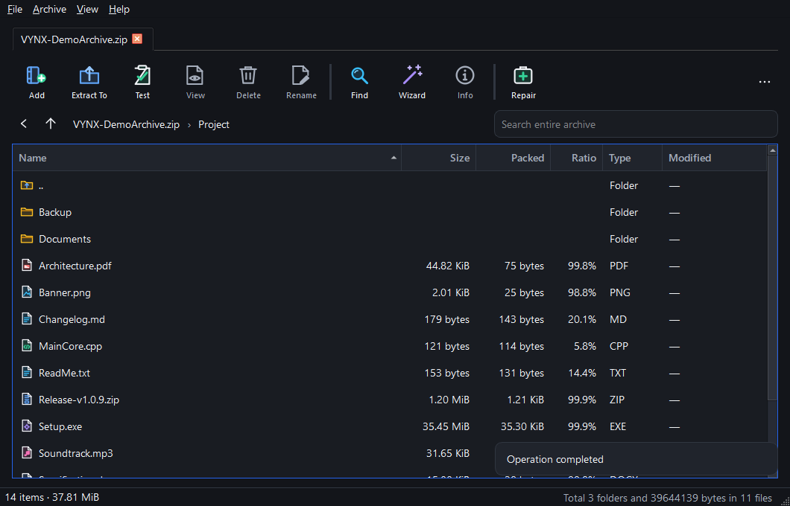
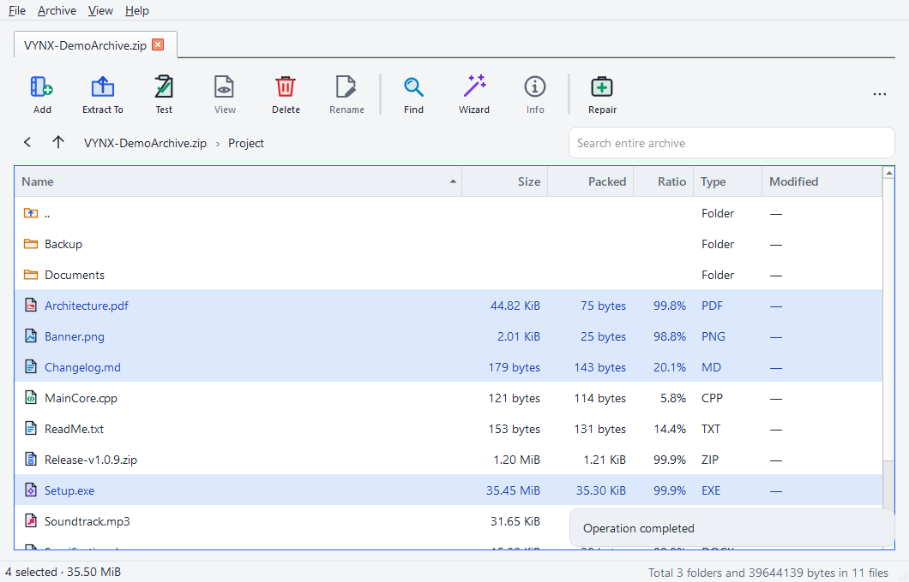
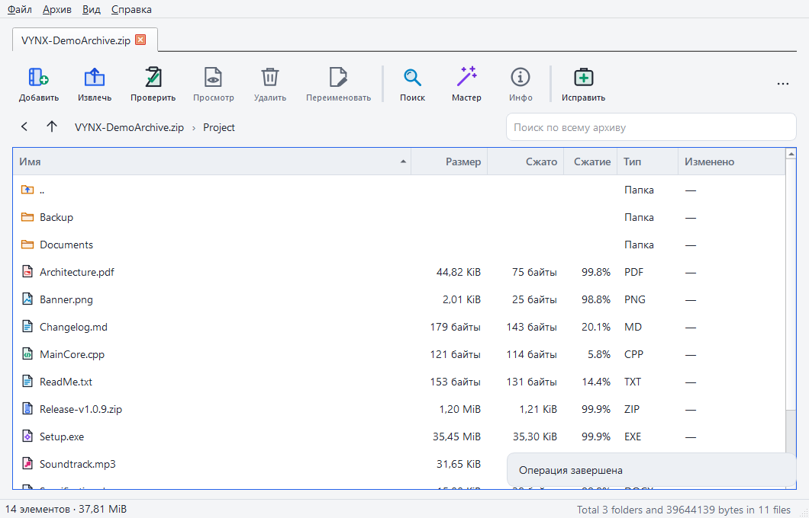
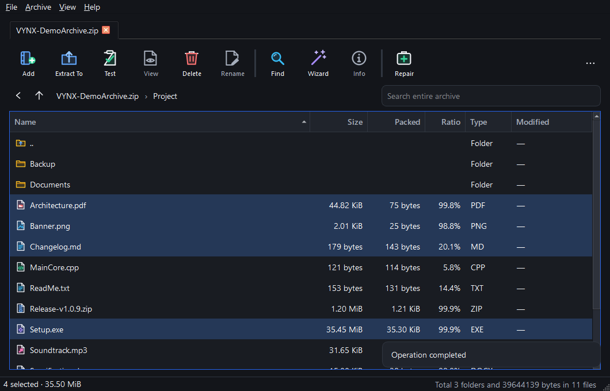

# VYNX ARC

An offline Windows archive manager built with C++20 / Qt 6 Widgets and a Rust
archive core connected through CXX. This repository contains the **1.1.1 release**.

<p align="center">
  
  
</p>

## ✨ Modern WinRAR-Inspired Interface (1.1.0)

VYNX ARC combines the beloved ergonomics and efficiency of classic WinRAR with modern high-DPI vector graphics, fluid light and dark themes, and high-performance interaction:

- **Command Action Toolbar**: 32×32 custom vector icons with descriptive labels underneath (`Add`, `Extract To`, `Test`, `View`, `Delete`, `Rename`, `Find`, `Wizard`, `Info`, `Repair`), grouped with clean visual dividers.
- **Sub-Navigation Bar**: `↑` (Up to parent folder), `←` (Back), interactive breadcrumbs, and fast real-time search filtering.
- **Parent Folder Navigation (`..`)**: Fixed at row 0 during all sorting, instantly returning to parent directories via double-click or Enter.
- **Rubberband Marquee Selection**: Drag-to-select multiple files with continuous rectangular visual feedback, full keyboard modifier support (Ctrl, Shift, Esc), and sub-millisecond O(1) performance even on 100,000 files.
- **Custom Vector SVG Suite**: 28 custom-crafted vector SVGs for all file types (`.exe`, `.pdf`, `.zip`, `.code`, `.txt`, `.doc`, `.iso`, `.audio`, `.video`, etc.) and UI operations, with theme-adaptive dual-tone rendering.

| Light Theme | Dark Theme |
| :---: | :---: |
|  |  |

| Multi-File Extended Selection | Russian Localization |
| :---: | :---: |
|  |  |

## Features & Capabilities

Open, browse, search, test and extract ZIP, 7Z, RAR4/RAR5, TAR, TAR.GZ,
TAR.XZ, TAR.BZ2, TAR.ZST and standalone GZIP/XZ/BZIP2/ZSTD/LZMA streams.
Create these formats, including native RAR5, AES-encrypted ZIP and encrypted 7Z
filenames. RAR4 remains read-only. RAR5 adds solid compression, AES/header
encryption, dictionary controls, recovery records and actual RAR5 volumes.
**1.1.1 status:** Modern WinRAR UI overhaul with vector icons and rubberband selection, native RAR5 writing and single-volume rebuilds tested with WinRAR (21/21 matrix), in-app auto-updates (`UpdateService`, `UpdateDialog`, `UpdateInstaller`) with SHA-256 validation, and automated CI/CD release packaging. See
[WinRAR UI acceptance report](docs/ACCEPTANCE_WINRAR_UI.md),
[1.0.0 acceptance report](docs/ACCEPTANCE_1_0.md) and
[current qualification status](docs/IMPLEMENTATION_STATUS.md).

See [RAR capabilities and limits](docs/NATIVE_RAR.md) and the
[1.0.0 acceptance report](docs/ACCEPTANCE_1_0.md).
Choose Store/Fast/Balanced/Maximum compression and
Eco/Balanced/Maximum resource modes. Operations run asynchronously with
progress and cancellation; additional archive requests enter a visible FIFO queue.
Each archive has its own tab with independent search, navigation and selection.
Idle tabs remain available during another archive's operation. The browser uses Qt model/view, with folder navigation, sortable columns,
keyboard shortcuts and drag-to-open. English, Ukrainian and Russian UI,
system/light/dark appearance, local recent history and portable settings are
available. No external archiver, browser engine, telemetry or service is used.

Search covers names and paths throughout the archive. Double-click a file or
press F3 for read-only text (UTF-8/UTF-16 with BOM), raster image or Hex preview.
The viewer reads up to 16 MiB, displays text up to 4 MiB and the first 64 KiB
in Hex. Internal preview creates no plaintext file. Ctrl+Enter offers external
opening of supported document/media types through a verified read-only temporary
copy, with explicit confirmation. Executables, scripts and shortcuts are excluded.

File > Batch extraction (Ctrl+Shift+E) queues archives into separate destination
folders. Pause/resume, reorder or cancel pending jobs in View > Operation queue;
double-click a row for error details. New creation requests can also be queued.
The bounded journal restores interrupted jobs for explicit review/retry; passwords
are never saved. Export a JSON report with terminal results and batch identifiers.

File > Convert archives (Ctrl+Shift+C) plans and queues supported source formats
into new ZIP/7Z archives, with independent source/destination encryption choices.
Originals are kept; output contents are decoded and verified before publication.
Retry failed batch jobs creates explicit new attempts with reviewed settings.
Large queue selections are stored completely in verified bounded sidecar files.
Unknown archive-write results require verification before retrying.

Archive decoders and writers used by the GUI run in supervised worker processes,
with Windows memory/process limits, a wall-time budget and forced cancellation of
unresponsive children. Other idle tabs and retained working copies survive a worker
failure. This is resource isolation, not a separate filesystem-permission sandbox.

Ctrl+Shift+Return creates an editable working copy of a supported ZIP/7Z/RAR5 file.
Use the View > Working copies dock to explicitly save it back, save as a new
archive, verify its contents, reload its source, export or discard it. Changed
sources stop a save; failed saves retain the edited copy.
Decrypted working content stays on disk until discarded. View > Temporary files
manages disposable read-only views separately. Tabs with pending edits show `*`.

Extraction validates Windows paths and collisions, blocks links/reparse points,
checks output limits, writes unique temporary files and publishes completed
streams. Existing files are preserved by default. These protections are tested,
but complete parser allocation budgets and filesystem race hardening still need
review before a production release.



## Run

Locally generated artifacts are under `dist/` (ignored by Git):

- `VYNX-ARC-Portable-x64.zip`: extract the complete directory and run `VynxArc.exe`.
- `VYNX-ARC-Setup-x64.exe`: per-user installer; optional shortcuts and Open With.
- `SHA256SUMS.txt`: SHA-256 checksums of those artifacts.

The binaries are unsigned. Package verification, the per-user upgrade path,
Open With registration and uninstallation are tested on the Windows development
host with an isolated runtime PATH. Independent clean-machine qualification and
Narrator review remain separate manual gates. Windows 11 x64 is the tested
platform. No development SDK is required to run the packages.

## Build

Install the pinned Rust MSVC toolchain, Qt 6.12.0 MSVC SDK, Visual Studio 2022
C++ Build Tools and Windows SDK, CMake and Ninja. See [BUILD.md](docs/BUILD.md).

```powershell
$env:VYNX_QT_ROOT = "$env:LOCALAPPDATA\VynxArcDev\QtMSVC"
scripts/build.ps1
scripts/build-release.ps1
```

Release packaging additionally requires Python for license collection and Inno
Setup 6 for the installer. `-SkipInstaller` generates only the portable package.

The bundled CLI supports `list`, `extract`, `create`, `test`, `add`, `delete`,
`rename`, `convert`, `hash`, `verify`, `hash-entry`, `verify-entry` and supervised
`isolated-list`, `isolated-test`, `isolated-extract`.
Run `vynxarc-cli --help`. Password operations currently use the GUI; secrets on
the command line are intentionally unsupported.

## Project status

The [1.0.0 acceptance report](docs/ACCEPTANCE_1_0.md) records completed workflows,
exact package identities, SHA-256 checksums, and qualification results. The
[0.9.0 acceptance report](docs/ACCEPTANCE_0_9.md) and earlier reports
([0.8.0](docs/MILESTONE_0_8.md), [0.7.0](docs/MILESTONE_0_7.md), [0.6.0](docs/MILESTONE_0_6.md))
retain the preceding milestone history.

[IMPLEMENTATION_STATUS.md](docs/IMPLEMENTATION_STATUS.md) records evidence,
capabilities and qualification notes. [SUPPORTED_FORMATS.md](docs/SUPPORTED_FORMATS.md)
defines actual format capabilities. [SECURITY_MODEL.md](docs/SECURITY_MODEL.md)
documents protections and operational security boundaries.

Run `scripts/check.ps1` for mandatory local source gates; release packaging enforces those same gates.

The application is MIT licensed. Qt and UnRAR retain their separate licenses;
see [THIRD_PARTY_NOTICES.md](docs/THIRD_PARTY_NOTICES.md) and the packaged `licenses/`
directory.
