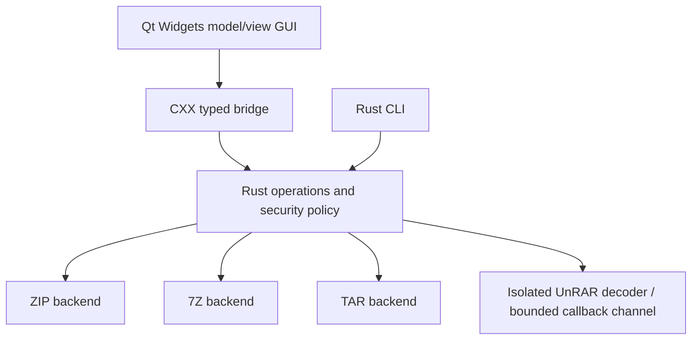

# Architecture

VYNX ARC uses C++20 / Qt 6 Widgets and a Rust core, statically linked through CXX.
Qt libraries are dynamically deployed beside the application. No archive operation
launches an external archiver. No background service, telemetry, or network client is used.

GUI workers own operation arguments and invoke the core outside the UI thread.
An opaque shared operation state provides atomic cancellation and bounded progress
snapshots. Operation FFI functions catch Rust panics and return errors. The GUI never validates
archive paths itself. Backends expose metadata and decode streams; the core decides
whether and where anything can be written.

Extraction validates the complete metadata plan before output, rejects links and
Windows-ambiguous names, and writes each file to a unique sibling temporary file.
Files are published only after decoding completes. Creation uses a temporary archive,
verification, flush and publication without replacing an existing archive by default.

RAR uses official UnRAR test/decode callbacks, never native extraction paths.
Wider stream-compression support remains a separate milestone; extensions alone
never advertise implemented support. Native Explorer integration will
launch the application and must never decode archives inside Explorer.
